# AILERON Projects Website

**[https://aileron-projects.github.io/](https://aileron-projects.github.io/)**

This repository contains website contents

## Documentation mechanism

In additions to the documentation managed in this repository, documentations of sub-projects are also aggregated and hosted.

This idea is just like [Antra](https://antora.org/) which is used by [Spring project](https://spring.io/projects).
But we do not use [Antra](https://antora.org/) to keep this project and documentation mechanism quite simple.

Document aggregation is scripted in

- GitHub workflow ([.github/workflows/gh-pages.yaml](.github/workflows/gh-pages.yaml)).
- Shell Script ([make.sh](make.sh) called from the workflow).
- Make ([Makefile](Makefile) called from the shell).

```mermaid
block-beta
  columns 3
  space:1
  website["🟪 <b>aileron-projects.github.io</b></br>(This repository)"]
  space:1
  space:3
  project1["🟩 <b>Sub Project Foo</b></br>TAG: v1.0.0</br>TAG: v1.0.1</br>TAG: v1.0.3</br>..."]
  project2["......"]
  project3["🟩 <b>Sub Project Bar</b></br>TAG: v2.1.0</br>TAG: v2.2.0</br>TAG: v2.3.0</br>..."]

  website --"fetch"--> project1
  website --"fetch"--> project2
  website --"fetch"--> project3
```



## Add new project

1. Create project folder in [content/](content/).
   1. See the [content/go/](content/go/) for example.
   2. Prepare `build.sh` in the directory.
2. Add `build.sh` path in the [Makfile](Makfile).
3. Add project link in [hugo.yaml](hugo.yaml).
   1. Project link should go in the `params.versions`.
4. Commit changes.

## Document structure

Sub-projects must have documentation structure described here.

Documents must be saved in `docs/website/`.
See the example in [aileron-example/](aileron-example/).

If documents follow this structure,

```txt
${project-repo}/
└── docs/
    └── website/
        ├── foo/
        │   ├── _index.en.md
        │   ├── example.go
        │   └── some-image.svg
        ├── bar/
        │   ├── index.en.md
        │   ├── example.go
        │   └── some-image.svg
        └── baz/
            ├── alice.en.md
            └── bob.en.md
```

Non markdown (`*.md`) files are moved into the [static/](static/) directory.

the actual website structure becomes as follows.

```txt
${tag}/
├── foo          --- /${tag}/foo
├── bar          --- /${tag}/bar
└── baz/         --- /${tag}/baz
    ├── alice    --- /${tag}/baz/alice
    └── bob      --- /${tag}/baz/bob
```

Basically, use `_index.md` to keep directory structure simple.

## Run website on local

Environment setup

- Install [Hugo Extended Version](https://gohugo.io/installation/).
- Install [Dart Sass](https://gohugo.io/functions/css/sass/#dart-sass).
- Install [Node.js](https://nodejs.org/).

Run on local

- `git clone --recursive  https://github.com/aileron-projects/aileron-projects.github.io.git`
- `cd aileron-projects.github.io`
- `npm install`
- `cd themes/docsy/ && npm install`
- `cd ../../`
- `hugo server -D`

Hugo and docsy versions used to build the website are written in the [.github/workflows/gh-pages.yaml](.github/workflows/gh-pages.yaml).

See also [hugo CLI documentations](https://gohugo.io/commands/hugo_server/).
